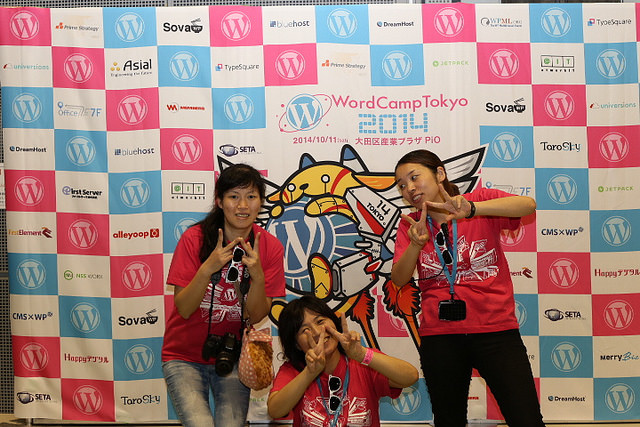

Photo Shooting Background Flag
====
This is a printable AI data of a background flag for photo shooting booth at [WordCamp Tokyo 2014](2014.tokyo.wordcamp.org).  
For practical use, add sponsor logos in random order.

  
  

###日本語
これは、[WordCamp Tokyo 2014](2014.tokyo.wordcamp.org)の記念写真ブースの背景幕用に印刷して使うAIデータです。  
実際には、スポンサーのロゴをばらばらの順番にいれて使います。
